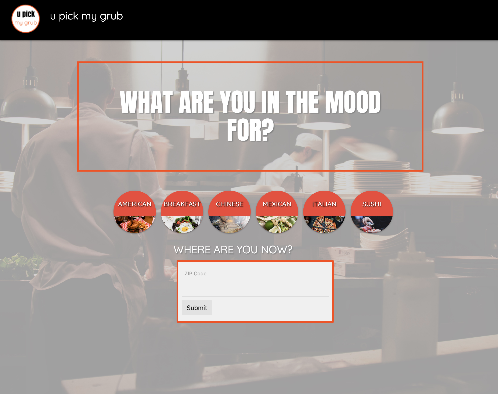

<h1>u pick my grub</h1>

This web application randomly generates a restaurant selection based on some user input. User selects cuisine type, zip code, price range, and distance from zip. The app will generate 1 suggestion, to include restaurant name, address, and review rating. User can click to read reviews and see location on a google map. If user isn't interested, a new suggestion will generate with a click of a button.

Link to web application: https://kristenmt.github.io/group-1/

<h4>Built with:</h4>
<ul>
    <li>HTML5</li>
    <li>CSS</li>
    <li>Javascript</li>
</ul>  

<h4>Technologies Used:</h4>
<ul>
    <li>Materialize</li>
    <li>Google Places API</li>
    <li>Google Maps API</li>
    <li>jQuery</li>
</ul>    

